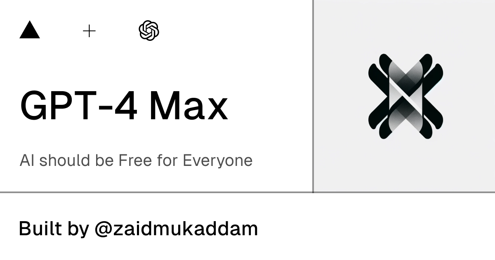

<h1 align="center">GPT-4 Max</h1>

## Description

This project is a chatbot application that uses [OpenAI's GPT-4 Turbo model](https://platform.openai.com/docs/models/gpt-4-turbo-and-gpt-4) to generate responses. It includes a user interface for sending and receiving messages including images.

## Features

- Chat interface with support for text and image messages
- Vision enabled chatbot that can describe images and call functions based on image content
- Weather forecast feature using [OpenWeather API](https://openweathermap.org/api)
- Web Browsing powered by [Tavily API](https://tavily.com/)

## Installation

1. Clone the repository
2. Install the dependencies using `pnpm install`
3. Copy the `.env.example` file to a new file named `.env` and fill in your API keys and other configuration values

## Usage

Run the application using `pnpm dev`. Open your browser and navigate to the URL displayed in the console.

## Contributing

Contributions are welcome. Please open an issue or submit a pull request.

## License

This project is licensed under the [MIT License](./LICENSE).